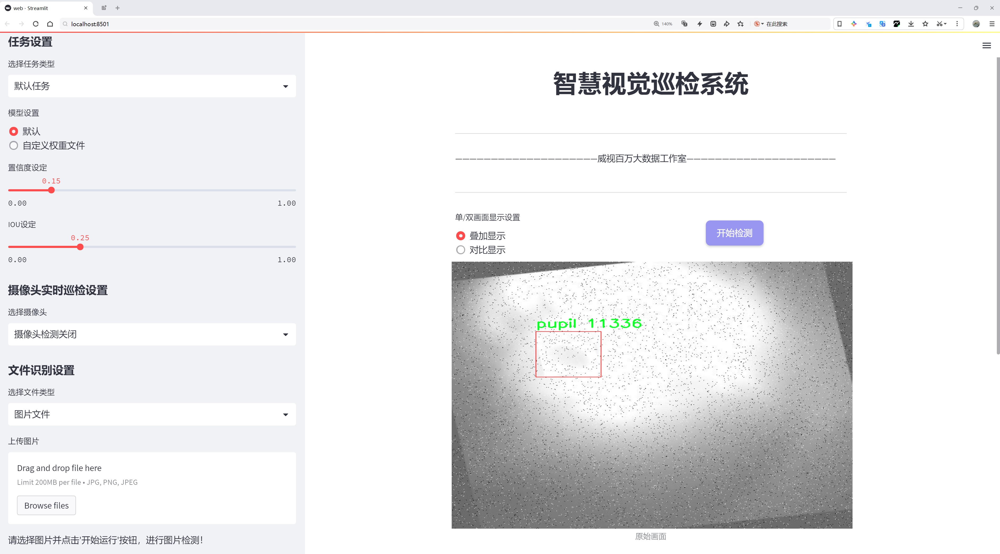
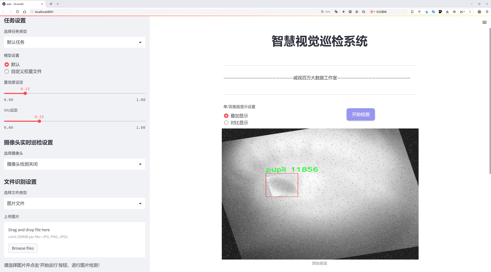
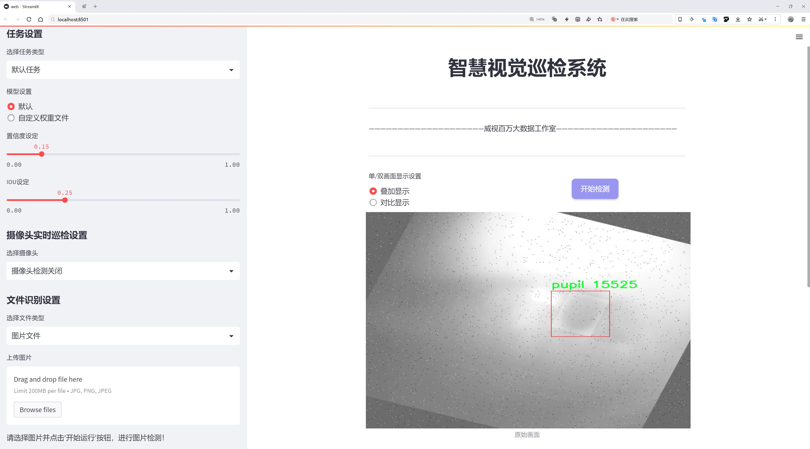
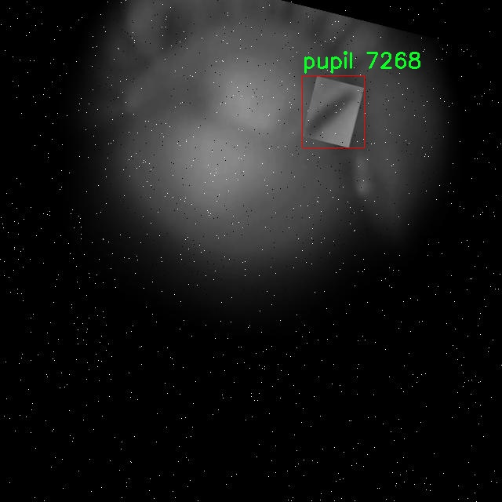
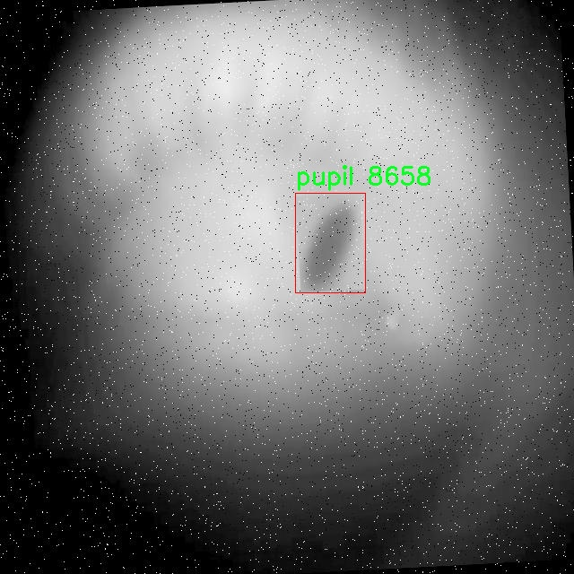
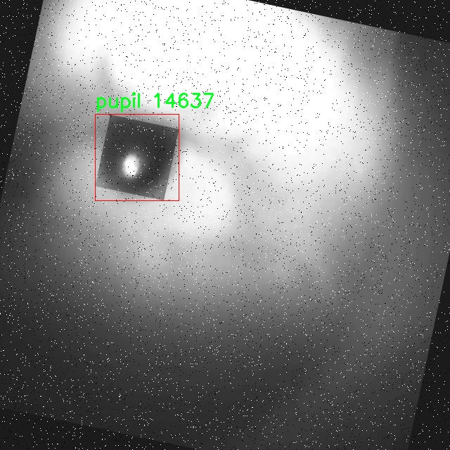
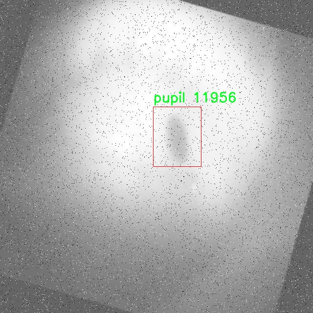
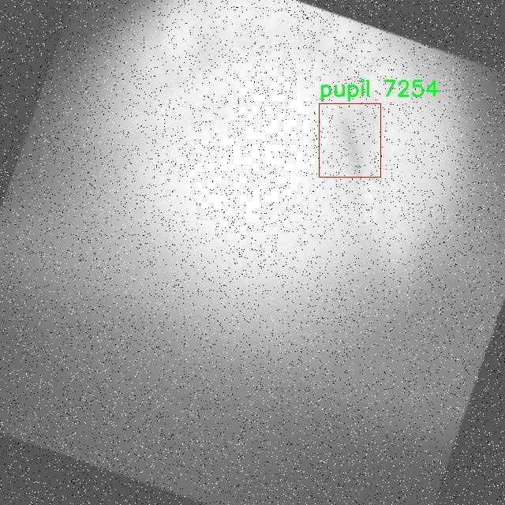

# 瞳孔检测检测系统源码分享
 # [一条龙教学YOLOV8标注好的数据集一键训练_70+全套改进创新点发刊_Web前端展示]

### 1.研究背景与意义

项目参考[AAAI Association for the Advancement of Artificial Intelligence](https://gitee.com/qunshansj/projects)

项目来源[AACV Association for the Advancement of Computer Vision](https://gitee.com/qunmasj/projects)

研究背景与意义

随着计算机视觉技术的迅猛发展，物体检测在各个领域的应用越来越广泛，尤其是在医学影像分析和人机交互等领域。瞳孔作为眼睛的重要组成部分，其形态和反应特征在生理和心理研究中具有重要的指示意义。瞳孔的变化不仅反映了个体的情绪状态，还与多种神经系统疾病密切相关。因此，开发高效、准确的瞳孔检测系统，对于医学诊断、心理学研究以及人机交互等领域具有重要的现实意义。

近年来，YOLO（You Only Look Once）系列模型因其优越的实时性和准确性，成为物体检测领域的主流算法之一。YOLOv8作为该系列的最新版本，结合了深度学习的先进技术，具备了更高的检测精度和更快的处理速度。然而，传统的YOLOv8模型在特定应用场景下，如瞳孔检测，仍然面临一些挑战。例如，瞳孔在不同光照条件、不同角度以及不同个体的情况下，其外观特征可能会发生显著变化，这对模型的鲁棒性提出了更高的要求。因此，基于改进YOLOv8的瞳孔检测系统的研究，旨在提升其在复杂环境下的检测性能。

本研究所使用的数据集IRPupils包含4100张图像，专注于瞳孔这一单一类别的检测。数据集的构建为模型的训练和验证提供了丰富的样本，涵盖了多种不同的拍摄条件和个体差异。通过对该数据集的深入分析，可以挖掘出瞳孔特征的多样性和复杂性，为改进YOLOv8模型提供重要的依据。我们将针对数据集中瞳孔的形状、大小、反射光线等特征进行特征提取，并结合改进的YOLOv8模型，设计出适合瞳孔检测的网络结构和训练策略。

本研究的意义不仅在于提升瞳孔检测的准确性和实时性，更在于推动计算机视觉技术在医学领域的应用。通过建立高效的瞳孔检测系统，可以为临床医生提供更为精准的诊断工具，帮助他们在神经系统疾病的早期筛查和情绪分析中做出更为科学的判断。此外，该系统的成功应用还将为人机交互界面的设计提供新的思路，使得设备能够更好地理解和响应用户的情感状态，从而提升用户体验。

综上所述，基于改进YOLOv8的瞳孔检测系统的研究，既具有重要的理论价值，也具备广泛的应用前景。通过深入探讨瞳孔检测的技术细节和应用场景，我们期望能够为相关领域的研究者提供新的思路和方法，推动计算机视觉技术在实际应用中的落地与发展。

### 2.图片演示







##### 注意：由于此博客编辑较早，上面“2.图片演示”和“3.视频演示”展示的系统图片或者视频可能为老版本，新版本在老版本的基础上升级如下：（实际效果以升级的新版本为准）

  （1）适配了YOLOV8的“目标检测”模型和“实例分割”模型，通过加载相应的权重（.pt）文件即可自适应加载模型。

  （2）支持“图片识别”、“视频识别”、“摄像头实时识别”三种识别模式。

  （3）支持“图片识别”、“视频识别”、“摄像头实时识别”三种识别结果保存导出，解决手动导出（容易卡顿出现爆内存）存在的问题，识别完自动保存结果并导出到tempDir中。

  （4）支持Web前端系统中的标题、背景图等自定义修改，后面提供修改教程。

  另外本项目提供训练的数据集和训练教程,暂不提供权重文件（best.pt）,需要您按照教程进行训练后实现图片演示和Web前端界面演示的效果。

### 3.视频演示

[3.1 视频演示](https://www.bilibili.com/video/BV16Lt5eTECi/)

### 4.数据集信息展示

##### 4.1 本项目数据集详细数据（类别数＆类别名）

nc: 1
names: ['pupil']


##### 4.2 本项目数据集信息介绍

数据集信息展示

在本研究中，我们使用了名为“IRPupils”的数据集，以改进YOLOv8的瞳孔检测系统。该数据集专注于瞳孔的识别与定位，旨在为计算机视觉领域提供高质量的训练数据，促进瞳孔检测技术的进步。IRPupils数据集的设计理念是为研究人员和开发者提供一个统一的、标准化的资源，以便于在各种环境下进行瞳孔检测的实验和模型训练。

IRPupils数据集包含一个类别，即“pupil”，这意味着所有的标注数据均围绕这一特定目标展开。尽管类别数量较少，但数据集的丰富性和多样性弥补了这一不足。数据集中包含了多种不同光照条件、角度和背景下的瞳孔图像，这为模型的训练提供了充分的变异性，使得YOLOv8能够更好地适应现实世界中的各种情况。通过这种方式，研究人员可以确保模型在实际应用中具有更高的鲁棒性和准确性。

在数据收集过程中，IRPupils数据集的构建者采用了先进的图像采集技术，确保了数据的高质量和高分辨率。这些图像不仅涵盖了正常状态下的瞳孔，还包括了不同情绪、健康状态以及光照变化下的瞳孔表现。这种多样性使得模型能够学习到更全面的特征，从而提高其在实际应用中的表现。此外，数据集中的每一张图像都经过了精确的标注，确保了瞳孔位置的准确性，为后续的模型训练提供了可靠的基础。

在数据集的使用过程中，研究人员可以通过数据增强技术进一步扩展数据集的有效性。通过对原始图像进行旋转、缩放、翻转等操作，可以生成更多的训练样本，从而提高模型的泛化能力。这种方法尤其适用于瞳孔检测任务，因为在不同的环境和条件下，瞳孔的外观可能会有所变化。通过增强数据集，YOLOv8能够更好地适应这些变化，提高其在各种场景下的检测性能。

IRPupils数据集的应用前景广泛，除了在瞳孔检测领域的直接应用外，其所蕴含的技术和方法也可以为其他生物特征识别任务提供借鉴。例如，在面部识别、眼动追踪等领域，瞳孔的准确检测是实现更高层次功能的基础。因此，IRPupils数据集不仅是一个独立的研究资源，更是推动相关领域技术进步的重要工具。

总之，IRPupils数据集为瞳孔检测系统的研究和开发提供了宝贵的资源。通过结合YOLOv8的强大检测能力与该数据集的丰富性，我们期望能够在瞳孔检测技术上取得显著的进展，推动相关应用的发展，为未来的智能视觉系统奠定坚实的基础。











### 5.全套项目环境部署视频教程（零基础手把手教学）

[5.1 环境部署教程链接（零基础手把手教学）](https://www.ixigua.com/7404473917358506534?logTag=c807d0cbc21c0ef59de5)


[5.2 安装Python虚拟环境创建和依赖库安装视频教程链接（零基础手把手教学）](https://www.ixigua.com/7404474678003106304?logTag=1f1041108cd1f708b01a)

### 6.手把手YOLOV8训练视频教程（零基础小白有手就能学会）

[6.1 手把手YOLOV8训练视频教程（零基础小白有手就能学会）](https://www.ixigua.com/7404477157818401292?logTag=d31a2dfd1983c9668658)

### 7.70+种全套YOLOV8创新点代码加载调参视频教程（一键加载写好的改进模型的配置文件）

[7.1 70+种全套YOLOV8创新点代码加载调参视频教程（一键加载写好的改进模型的配置文件）](https://www.ixigua.com/7404478314661806627?logTag=29066f8288e3f4eea3a4)

### 8.70+种全套YOLOV8创新点原理讲解（非科班也可以轻松写刊发刊，V10版本正在科研待更新）

由于篇幅限制，每个创新点的具体原理讲解就不一一展开，具体见下列网址中的创新点对应子项目的技术原理博客网址【Blog】：


[8.1 70+种全套YOLOV8创新点原理讲解链接](https://gitee.com/qunmasj/good)

### 9.系统功能展示（检测对象为举例，实际内容以本项目数据集为准）

图9.1.系统支持检测结果表格显示

  图9.2.系统支持置信度和IOU阈值手动调节

  图9.3.系统支持自定义加载权重文件best.pt(需要你通过步骤5中训练获得)

  图9.4.系统支持摄像头实时识别

  图9.5.系统支持图片识别

  图9.6.系统支持视频识别

  图9.7.系统支持识别结果文件自动保存

  图9.8.系统支持Excel导出检测结果数据


### 10.原始YOLOV8算法原理

原始YOLOv8算法原理

YOLOv8（You Only Look Once version 8）是由Ultralytics公司于2023年1月10日发布的目标检测算法，它在YOLO系列的前几代基础上进行了深度优化，标志着目标检测技术的又一次重大进步。YOLOv8的设计理念依然围绕着快速、准确和易于使用的目标检测任务展开，旨在解决传统目标检测方法在速度和精度上的矛盾。通过引入一系列创新的网络结构和训练策略，YOLOv8不仅提升了目标检测的精度，还显著提高了处理速度，使其在智能监控、自动驾驶、人脸识别等多个应用场景中表现出色。

YOLOv8的核心原理在于其独特的网络架构和高效的训练策略。与前代YOLO版本相比，YOLOv8采用了更深的卷积神经网络结构，这使得模型能够更好地提取图像中的特征信息。其输入图像的默认尺寸为640x640，但在实际应用中，YOLOv8通过自适应图像缩放技术，能够处理不同长宽比的图像，从而提高了目标检测的灵活性和准确性。自适应缩放的过程是将图像的长边按比例缩小到指定尺寸，然后对短边进行填充，这种方式有效减少了信息冗余，提升了检测速度。

在网络结构方面，YOLOv8对主干网络进行了显著改进，特别是在特征提取模块的设计上。YOLOv8将YOLOv5中的C3模块替换为C2F模块，C2F模块通过并行多个梯度流分支，增强了模型对不同特征的学习能力。这种设计不仅保持了网络的轻量化特性，还提高了模型的精度和延迟表现。此外，YOLOv8的Neck部分也进行了优化，直接将Backbone不同阶段输出的特征进行上采样，简化了网络结构，提高了信息传递的效率。

YOLOv8的Head部分是其最大的创新之一。与YOLOv5的Coupled-Head结构不同，YOLOv8采用了Decoupled-Head结构，将目标检测和分类任务分开处理。具体而言，输入特征图首先通过两个1x1卷积模块进行降维，然后分别用于类别预测和边界框位置及IoU（交并比）预测。这种解耦设计使得模型在处理不同任务时能够更加专注，从而提高了整体的检测性能。

在损失函数的设计上，YOLOv8也进行了重要的改进。它采用了分布焦点损失（DFL）和完美交并比损失（CIoULoss），使得模型在训练过程中能够更快地聚焦于标签附近的区域，从而提高了检测的准确性。同时，YOLOv8抛弃了传统的Anchor-Based方法，转而采用Anchor-Free的策略。这一转变使得模型不再依赖于预设的锚框，而是将目标检测转化为关键点检测，极大地简化了网络结构，并提高了模型的泛化能力。

YOLOv8的多尺度训练和测试策略也是其提升性能的重要因素之一。通过在不同尺度下进行训练，模型能够更好地适应各种尺寸的目标，提高了检测的鲁棒性。此外，YOLOv8还引入了Mosaic数据增强技术，该技术通过随机拼接多张图像生成新的训练样本，迫使模型学习到不同位置和周围像素的特征，从而有效提升了预测精度。

在性能方面，YOLOv8相较于其前身YOLOv7在精度和帧率上均有显著提升。根据相关实验结果，YOLOv8的精度提高了43.23%，帧率提升了10.28倍，这使得YOLOv8在实时目标检测任务中具备了更强的竞争力。通过对比其他目标检测算法，如SSD，YOLOv8展现出更高的性能和准确率，成为了当前最优秀的目标检测算法之一。

综上所述，YOLOv8通过深度优化的网络结构、创新的训练策略和高效的损失函数设计，极大地提升了目标检测的精度和速度。其在多种应用场景中的广泛适用性，使得YOLOv8成为研究和实践中不可或缺的工具。随着YOLOv8的不断发展和完善，未来的目标检测技术将会更加智能和高效，为各类实际应用提供更为强大的支持。


### 11.项目核心源码讲解（再也不用担心看不懂代码逻辑）

#### 11.1 code\ultralytics\hub\utils.py

以下是经过简化和注释的核心代码部分，保留了最重要的功能和逻辑。

```python
import os
import platform
import random
import sys
import threading
import time
from pathlib import Path
import requests
from ultralytics.utils import (
    ENVIRONMENT,
    LOGGER,
    RANK,
    SETTINGS,
    ONLINE,
    __version__,
    colorstr,
    is_colab,
    is_git_dir,
    is_pip_package,
)

# 设置API的根URL
HUB_API_ROOT = os.environ.get("ULTRALYTICS_HUB_API", "https://api.ultralytics.com")
PREFIX = colorstr("Ultralytics HUB: ")

def requests_with_progress(method, url, **kwargs):
    """
    使用指定的方法和URL发起HTTP请求，并可选地显示进度条。

    Args:
        method (str): HTTP方法（如'GET'或'POST'）。
        url (str): 请求的URL。
        **kwargs (dict): 传递给requests.request函数的其他关键字参数。

    Returns:
        (requests.Response): HTTP请求的响应对象。
    """
    response = requests.request(method, url, stream=True, **kwargs)  # 发起请求
    total = int(response.headers.get("content-length", 0))  # 获取响应内容的总大小
    pbar = TQDM(total=total, unit="B", unit_scale=True, unit_divisor=1024)  # 初始化进度条
    for data in response.iter_content(chunk_size=1024):  # 分块读取响应内容
        pbar.update(len(data))  # 更新进度条
    pbar.close()  # 关闭进度条
    return response  # 返回响应对象

def smart_request(method, url, retry=3, timeout=30, thread=True, **kwargs):
    """
    使用'requests'库发起HTTP请求，支持重试机制。

    Args:
        method (str): 请求使用的HTTP方法。
        url (str): 请求的URL。
        retry (int): 重试次数，默认为3。
        timeout (int): 超时时间，默认为30秒。
        thread (bool): 是否在单独的线程中执行请求，默认为True。
        **kwargs (dict): 传递给requests函数的其他关键字参数。

    Returns:
        (requests.Response): HTTP响应对象。
    """
    @TryExcept(verbose=True)
    def func(func_method, func_url, **func_kwargs):
        """执行HTTP请求，支持重试和超时处理。"""
        r = None  # 初始化响应
        for i in range(retry + 1):
            r = requests_with_progress(func_method, func_url, **func_kwargs)  # 发起请求
            if r.status_code < 300:  # 如果状态码为2xx，表示成功
                break
            time.sleep(2**i)  # 指数退避策略
        return r

    if thread:
        threading.Thread(target=func, args=(method, url), kwargs=kwargs, daemon=True).start()  # 在新线程中执行
    else:
        return func(method, url, **kwargs)  # 同步执行请求

class Events:
    """
    用于收集匿名事件分析的类。事件分析在设置中启用sync时生效。

    Attributes:
        url (str): 发送匿名事件的URL。
        rate_limit (float): 发送事件的速率限制（秒）。
        metadata (dict): 包含环境元数据的字典。
        enabled (bool): 根据条件启用或禁用事件收集。
    """
    url = "https://www.google-analytics.com/mp/collect?measurement_id=G-X8NCJYTQXM&api_secret=QLQrATrNSwGRFRLE-cbHJw"

    def __init__(self):
        """初始化Events对象，设置默认值。"""
        self.events = []  # 事件列表
        self.rate_limit = 60.0  # 速率限制（秒）
        self.metadata = {
            "cli": Path(sys.argv[0]).name == "yolo",
            "install": "git" if is_git_dir() else "pip" if is_pip_package() else "other",
            "python": ".".join(platform.python_version_tuple()[:2]),  # Python版本
            "version": __version__,
            "env": ENVIRONMENT,
            "session_id": round(random.random() * 1e15),  # 随机会话ID
            "engagement_time_msec": 1000,
        }
        self.enabled = (
            SETTINGS["sync"]
            and RANK in (-1, 0)
            and ONLINE
            and (is_pip_package() or is_git_dir())
        )

    def __call__(self, cfg):
        """
        尝试将新事件添加到事件列表，并在达到速率限制时发送事件。

        Args:
            cfg (IterableSimpleNamespace): 包含模式和任务信息的配置对象。
        """
        if not self.enabled:
            return  # 如果事件收集被禁用，直接返回

        # 添加事件到列表
        if len(self.events) < 25:  # 限制事件列表最多25个事件
            params = {
                "task": cfg.task,
                "model": cfg.model,
            }
            self.events.append({"name": cfg.mode, "params": params})

        # 检查速率限制
        if (time.time() - self.t) >= self.rate_limit:
            data = {"client_id": SETTINGS["uuid"], "events": self.events}  # 构建数据
            smart_request("post", self.url, json=data, retry=0)  # 发送事件
            self.events = []  # 重置事件列表
            self.t = time.time()  # 重置时间

# 初始化事件收集
events = Events()
```

### 代码说明：
1. **requests_with_progress**: 该函数用于发起HTTP请求，并在下载过程中显示进度条。
2. **smart_request**: 该函数用于发起HTTP请求，支持重试机制和超时控制。
3. **Events类**: 该类用于收集和发送匿名事件分析，支持速率限制和条件启用。
4. **事件收集的初始化**: 创建一个`Events`实例，用于后续的事件记录和发送。

这个文件是Ultralytics YOLO项目中的一个工具模块，主要用于处理与Ultralytics HUB相关的HTTP请求和事件分析。首先，文件导入了一些必要的库和模块，包括操作系统、平台、随机数、线程、时间等标准库，以及Ultralytics项目中的一些工具函数和常量。

文件定义了两个主要的API根地址，分别用于Ultralytics HUB的API和Web访问，这些地址可以通过环境变量进行配置。接下来，文件中定义了一些辅助函数，例如`request_with_credentials`，该函数用于在Google Colab环境中进行带有凭证的AJAX请求。它通过JavaScript代码向指定的URL发送POST请求，并返回响应数据。

另一个重要的函数是`requests_with_progress`，它允许用户在进行HTTP请求时显示下载进度条。该函数会根据响应的内容长度来更新进度条，并处理可能出现的连接错误。

`smart_request`函数则是一个更复杂的HTTP请求处理函数，它支持重试机制和超时设置。该函数在请求失败时会进行指数退避重试，直到达到最大重试次数或超时为止。它还可以在后台线程中执行请求，并根据需要显示进度条。

接下来，文件定义了一个`Events`类，用于收集匿名事件分析数据。该类的构造函数初始化了一些事件相关的属性，包括事件列表、速率限制、元数据等。事件的发送是基于一定的条件，例如是否启用事件收集、当前的运行环境等。类的`__call__`方法用于添加新事件并在达到速率限制时发送事件数据。

最后，文件实例化了`Events`类，创建了一个`events`对象，用于后续的事件记录和发送。整体来看，这个模块的主要功能是简化与Ultralytics HUB的交互，并提供事件分析的能力，以便更好地跟踪和优化用户体验。

#### 11.2 70+种YOLOv8算法改进源码大全和调试加载训练教程（非必要）\ultralytics\nn\autobackend.py

以下是经过简化并注释的核心代码部分，主要关注 `AutoBackend` 类及其相关方法：

```python
import torch
import torch.nn as nn
from ultralytics.utils import yaml_load, check_requirements

class AutoBackend(nn.Module):
    """
    处理 Ultralytics YOLO 模型的动态后端选择，用于推理。
    支持多种模型格式，便于在不同平台上部署模型。
    """

    @torch.no_grad()
    def __init__(self, weights='yolov8n.pt', device=torch.device('cpu'), fp16=False, fuse=True, data=None):
        """
        初始化 AutoBackend 进行推理。

        参数:
            weights (str): 模型权重文件的路径，默认为 'yolov8n.pt'。
            device (torch.device): 运行模型的设备，默认为 CPU。
            fp16 (bool): 启用半精度推理，仅在特定后端支持，默认为 False。
            fuse (bool): 优化 Conv2D + BatchNorm 层，默认为 True。
            data (str | Path | optional): 包含类名的额外 data.yaml 文件的路径，默认为 None。
        """
        super().__init__()
        # 确定模型类型
        model_type = self._model_type(weights)
        # 其他初始化操作...
        
        # 加载模型
        if model_type['pt']:  # 如果是 PyTorch 模型
            from ultralytics.nn.tasks import attempt_load_weights
            self.model = attempt_load_weights(weights, device=device, inplace=True, fuse=fuse)
        # 其他模型格式的加载...
        
        # 检查类名
        self.names = self._apply_default_class_names(data)
        self.names = check_class_names(self.names)

    def forward(self, im):
        """
        对输入图像进行推理。

        参数:
            im (torch.Tensor): 进行推理的图像张量。

        返回:
            (torch.Tensor): 推理结果。
        """
        # 图像预处理
        if self.fp16:
            im = im.half()  # 转换为 FP16
        # 进行推理
        y = self.model(im)  # 调用模型进行推理
        return y

    @staticmethod
    def _model_type(p='path/to/model.pt'):
        """
        根据模型文件路径返回模型类型。

        参数:
            p: 模型文件的路径，默认为 'path/to/model.pt'。
        返回:
            list: 各种模型格式的布尔值列表。
        """
        # 确定模型格式
        types = [p.endswith(suffix) for suffix in ['.pt', '.onnx', '.pb', '.tflite']]  # 检查后缀
        return types

    @staticmethod
    def _apply_default_class_names(data):
        """应用默认类名或返回数字类名。"""
        return yaml_load(data)['names'] if data else {i: f'class{i}' for i in range(999)}  # 默认类名
```

### 代码注释说明：

1. **AutoBackend 类**：负责根据不同的模型格式动态选择推理后端，支持多种模型格式（如 PyTorch、ONNX 等）。
   
2. **__init__ 方法**：初始化类的实例，加载模型权重并检查类名。根据输入的权重路径确定模型类型，并加载相应的模型。

3. **forward 方法**：接收输入图像并进行推理，返回推理结果。

4. **_model_type 方法**：根据模型文件的后缀名判断模型类型，返回一个布尔值列表，指示支持的模型格式。

5. **_apply_default_class_names 方法**：从 YAML 文件中加载类名，如果没有提供，则返回默认的数字类名。 

这些核心部分和注释提供了对代码功能的清晰理解，便于后续的使用和维护。

这个程序文件是Ultralytics YOLO（You Only Look Once）模型的一个核心组件，主要负责动态选择后端以运行推理。文件中的`AutoBackend`类提供了一个抽象层，支持多种模型格式，包括PyTorch、ONNX、TensorRT等，使得模型可以在不同的平台上进行部署和推理。

首先，文件导入了一些必要的库，包括`torch`、`cv2`、`numpy`等，以及一些Ultralytics特有的工具和功能。接着，定义了一个`check_class_names`函数，用于检查和转换类别名称，确保它们符合预期的格式。

`AutoBackend`类的构造函数接受多个参数，如模型权重路径、设备类型、是否使用DNN模块等。构造函数内部首先确定模型的类型，然后根据不同的模型格式加载相应的模型。它支持多种后端，包括PyTorch、TorchScript、ONNX、OpenVINO、TensorRT等。每种格式的加载方式都有相应的处理逻辑，例如对于PyTorch模型，使用`attempt_load_weights`函数加载权重；对于ONNX模型，使用OpenCV的DNN模块进行加载。

在加载模型后，构造函数还会处理模型的元数据，如步幅、批量大小、图像大小和类别名称等。这些信息在后续的推理过程中会被使用。

`forward`方法是类的核心功能之一，负责执行推理。它接受一个图像张量，并根据模型的类型调用相应的推理方法。支持的数据增强和可视化选项使得推理结果可以更直观地展示。

此外，`warmup`方法用于通过运行一次前向传播来预热模型，以提高后续推理的效率。`_apply_default_class_names`和`_model_type`是静态方法，分别用于应用默认类别名称和确定模型文件的类型。

总的来说，这个文件的设计使得YOLO模型能够灵活地在多种后端和平台上运行，极大地增强了模型的可用性和适应性。通过动态选择后端，用户可以根据自己的需求和环境，选择最合适的推理方式。

#### 11.3 ui.py

```python
import sys
import subprocess

def run_script(script_path):
    """
    使用当前 Python 环境运行指定的脚本。

    Args:
        script_path (str): 要运行的脚本路径

    Returns:
        None
    """
    # 获取当前 Python 解释器的路径
    python_path = sys.executable

    # 构建运行命令
    command = f'"{python_path}" -m streamlit run "{script_path}"'

    # 执行命令
    result = subprocess.run(command, shell=True)
    if result.returncode != 0:
        print("脚本运行出错。")


# 实例化并运行应用
if __name__ == "__main__":
    # 指定您的脚本路径
    script_path = "web.py"  # 这里可以直接指定脚本路径

    # 运行脚本
    run_script(script_path)
```

### 代码核心部分及注释

1. **导入必要的模块**：
   - `sys`：用于访问与 Python 解释器相关的变量和函数。
   - `subprocess`：用于执行外部命令。

2. **定义 `run_script` 函数**：
   - 该函数接收一个脚本路径作为参数，并使用当前 Python 环境运行该脚本。

3. **获取当前 Python 解释器的路径**：
   - `python_path = sys.executable`：获取当前正在使用的 Python 解释器的完整路径。

4. **构建运行命令**：
   - `command = f'"{python_path}" -m streamlit run "{script_path}"'`：构建一个命令字符串，用于运行指定的脚本。

5. **执行命令**：
   - `result = subprocess.run(command, shell=True)`：使用 `subprocess.run` 执行构建的命令。
   - `if result.returncode != 0:`：检查命令的返回码，如果不为 0，表示脚本运行出错，打印错误信息。

6. **主程序入口**：
   - `if __name__ == "__main__":`：确保只有在直接运行该脚本时才会执行以下代码。
   - `script_path = "web.py"`：指定要运行的脚本路径。
   - `run_script(script_path)`：调用 `run_script` 函数，运行指定的脚本。

这个程序文件的主要功能是通过当前的 Python 环境来运行一个指定的脚本，具体是一个名为 `web.py` 的文件。程序首先导入了必要的模块，包括 `sys`、`os` 和 `subprocess`，这些模块分别用于系统操作、文件路径处理和执行外部命令。

在 `run_script` 函数中，首先获取当前 Python 解释器的路径，使用 `sys.executable` 可以获取到当前运行的 Python 解释器的完整路径。接着，构建一个命令字符串，这个命令是用来运行 `streamlit` 的，格式为 `python -m streamlit run script_path`，其中 `script_path` 是要运行的脚本的路径。

然后，使用 `subprocess.run` 方法来执行这个命令。这个方法会在一个新的子进程中运行命令，并等待其完成。`shell=True` 参数表示命令将在一个新的 shell 中执行。执行后，程序会检查返回的状态码，如果状态码不为 0，表示脚本运行过程中出现了错误，程序会打印出“脚本运行出错”的提示。

在文件的最后部分，使用 `if __name__ == "__main__":` 来判断当前模块是否是主程序。如果是，则指定要运行的脚本路径，这里使用了 `abs_path` 函数来获取 `web.py` 的绝对路径。最后，调用 `run_script` 函数来执行这个脚本。

总体来说，这个程序的目的是为了方便地在一个 Python 环境中运行一个 Streamlit 应用脚本，并处理可能出现的错误。

#### 11.4 code\ultralytics\models\yolo\classify\val.py

以下是代码中最核心的部分，并附上详细的中文注释：

```python
import torch
from ultralytics.data import ClassificationDataset, build_dataloader
from ultralytics.engine.validator import BaseValidator
from ultralytics.utils.metrics import ClassifyMetrics, ConfusionMatrix
from ultralytics.utils.plotting import plot_images

class ClassificationValidator(BaseValidator):
    """
    扩展自 BaseValidator 类的分类验证器，用于基于分类模型的验证。
    """

    def __init__(self, dataloader=None, save_dir=None, pbar=None, args=None, _callbacks=None):
        """初始化 ClassificationValidator 实例，包含数据加载器、保存目录、进度条和参数。"""
        super().__init__(dataloader, save_dir, pbar, args, _callbacks)
        self.targets = None  # 存储真实标签
        self.pred = None     # 存储模型预测结果
        self.args.task = "classify"  # 设置任务类型为分类
        self.metrics = ClassifyMetrics()  # 初始化分类指标

    def init_metrics(self, model):
        """初始化混淆矩阵、类名以及 top-1 和 top-5 准确率。"""
        self.names = model.names  # 获取类名
        self.nc = len(model.names)  # 获取类别数量
        self.confusion_matrix = ConfusionMatrix(nc=self.nc, conf=self.args.conf, task="classify")  # 初始化混淆矩阵
        self.pred = []  # 初始化预测结果列表
        self.targets = []  # 初始化真实标签列表

    def preprocess(self, batch):
        """预处理输入批次并返回处理后的数据。"""
        batch["img"] = batch["img"].to(self.device, non_blocking=True)  # 将图像数据转移到设备上
        batch["img"] = batch["img"].half() if self.args.half else batch["img"].float()  # 根据参数选择数据类型
        batch["cls"] = batch["cls"].to(self.device)  # 将标签转移到设备上
        return batch

    def update_metrics(self, preds, batch):
        """使用模型预测和批次目标更新运行指标。"""
        n5 = min(len(self.names), 5)  # 取类别数和5中的最小值
        self.pred.append(preds.argsort(1, descending=True)[:, :n5])  # 获取前5个预测结果
        self.targets.append(batch["cls"])  # 存储真实标签

    def finalize_metrics(self, *args, **kwargs):
        """最终化模型的指标，如混淆矩阵和速度。"""
        self.confusion_matrix.process_cls_preds(self.pred, self.targets)  # 处理预测结果和真实标签
        self.metrics.speed = self.speed  # 记录速度
        self.metrics.confusion_matrix = self.confusion_matrix  # 记录混淆矩阵

    def get_stats(self):
        """返回通过处理目标和预测获得的指标字典。"""
        self.metrics.process(self.targets, self.pred)  # 处理真实标签和预测结果
        return self.metrics.results_dict  # 返回结果字典

    def build_dataset(self, img_path):
        """创建并返回一个 ClassificationDataset 实例，使用给定的图像路径和预处理参数。"""
        return ClassificationDataset(root=img_path, args=self.args, augment=False, prefix=self.args.split)

    def get_dataloader(self, dataset_path, batch_size):
        """构建并返回一个用于分类任务的数据加载器。"""
        dataset = self.build_dataset(dataset_path)  # 构建数据集
        return build_dataloader(dataset, batch_size, self.args.workers, rank=-1)  # 返回数据加载器

    def print_results(self):
        """打印 YOLO 目标检测模型的评估指标。"""
        pf = "%22s" + "%11.3g" * len(self.metrics.keys)  # 打印格式
        LOGGER.info(pf % ("all", self.metrics.top1, self.metrics.top5))  # 打印 top-1 和 top-5 准确率

    def plot_val_samples(self, batch, ni):
        """绘制验证图像样本。"""
        plot_images(
            images=batch["img"],
            batch_idx=torch.arange(len(batch["img"])),
            cls=batch["cls"].view(-1),  # 使用 .view() 而不是 .squeeze() 以适应分类模型
            fname=self.save_dir / f"val_batch{ni}_labels.jpg",
            names=self.names,
            on_plot=self.on_plot,
        )

    def plot_predictions(self, batch, preds, ni):
        """在输入图像上绘制预测结果并保存结果。"""
        plot_images(
            batch["img"],
            batch_idx=torch.arange(len(batch["img"])),
            cls=torch.argmax(preds, dim=1),  # 获取预测类别
            fname=self.save_dir / f"val_batch{ni}_pred.jpg",
            names=self.names,
            on_plot=self.on_plot,
        )
```

### 代码核心部分说明：
1. **类定义**：`ClassificationValidator` 类用于处理分类模型的验证。
2. **初始化方法**：设置基本参数，初始化指标和混淆矩阵。
3. **数据预处理**：将输入数据转移到设备上并进行类型转换。
4. **指标更新**：根据模型的预测结果和真实标签更新分类指标。
5. **最终化指标**：处理完所有数据后，计算并保存最终的指标。
6. **数据集和数据加载器构建**：创建数据集和数据加载器，以便于后续的验证过程。
7. **结果打印和绘图**：打印评估结果，并可视化验证样本和预测结果。

这个程序文件是一个用于YOLO（You Only Look Once）模型分类任务的验证器，继承自基础验证器类`BaseValidator`。其主要功能是对分类模型的性能进行评估，包括计算准确率、混淆矩阵等指标，并提供可视化结果。

在文件开头，导入了必要的库和模块，包括PyTorch、数据集构建、验证器基类、日志记录、分类指标和绘图工具。接着定义了`ClassificationValidator`类，该类用于处理分类模型的验证过程。

构造函数`__init__`初始化了验证器的实例，接收数据加载器、保存目录、进度条、参数和回调函数等参数。它还初始化了一些属性，包括目标标签和预测结果，并设置任务类型为“分类”。

`get_desc`方法返回一个格式化的字符串，用于总结分类指标，包括类别名称、Top-1准确率和Top-5准确率。

`init_metrics`方法用于初始化混淆矩阵、类别名称和准确率的计算。它根据模型的类别名称设置相关属性，并准备存储预测和目标标签。

`preprocess`方法对输入批次进行预处理，将图像和标签转移到指定设备，并根据参数决定数据类型（半精度或单精度）。

`update_metrics`方法在每个批次处理后更新运行中的指标，记录模型的预测结果和真实标签。

`finalize_metrics`方法在所有批次处理完成后，最终化模型的指标，包括处理混淆矩阵和计算速度。如果需要绘图，还会生成混淆矩阵的可视化。

`get_stats`方法返回一个字典，包含通过处理目标和预测得到的各项指标。

`build_dataset`方法根据给定的图像路径和预处理参数创建并返回一个`ClassificationDataset`实例。

`get_dataloader`方法构建并返回一个数据加载器，用于分类任务，接受数据集路径和批次大小作为参数。

`print_results`方法打印YOLO模型的评估指标，包括Top-1和Top-5准确率。

`plot_val_samples`方法用于绘制验证图像样本，并将结果保存为图像文件。

`plot_predictions`方法则是在输入图像上绘制预测结果，并保存相应的图像文件。

总体来说，这个文件提供了一个完整的框架，用于对YOLO分类模型进行验证和评估，涵盖了数据处理、指标计算和结果可视化等多个方面。

#### 11.5 train.py

以下是经过简化和注释的核心代码部分，主要关注于YOLO模型的训练过程：

```python
import random
import numpy as np
import torch.nn as nn
from ultralytics.data import build_dataloader, build_yolo_dataset
from ultralytics.engine.trainer import BaseTrainer
from ultralytics.models import yolo
from ultralytics.nn.tasks import DetectionModel
from ultralytics.utils import LOGGER, RANK
from ultralytics.utils.torch_utils import de_parallel, torch_distributed_zero_first

class DetectionTrainer(BaseTrainer):
    """
    基于检测模型的训练类，继承自BaseTrainer类。
    """

    def build_dataset(self, img_path, mode="train", batch=None):
        """
        构建YOLO数据集。

        参数:
            img_path (str): 包含图像的文件夹路径。
            mode (str): 模式，`train`表示训练模式，`val`表示验证模式。
            batch (int, optional): 批次大小，适用于`rect`模式。默认为None。
        """
        gs = max(int(de_parallel(self.model).stride.max() if self.model else 0), 32)  # 获取模型的最大步幅
        return build_yolo_dataset(self.args, img_path, batch, self.data, mode=mode, rect=mode == "val", stride=gs)

    def get_dataloader(self, dataset_path, batch_size=16, rank=0, mode="train"):
        """构建并返回数据加载器。"""
        assert mode in ["train", "val"]  # 确保模式合法
        with torch_distributed_zero_first(rank):  # 在分布式环境中，确保数据集只初始化一次
            dataset = self.build_dataset(dataset_path, mode, batch_size)
        shuffle = mode == "train"  # 训练模式下打乱数据
        workers = self.args.workers if mode == "train" else self.args.workers * 2  # 设置工作线程数
        return build_dataloader(dataset, batch_size, workers, shuffle, rank)  # 返回数据加载器

    def preprocess_batch(self, batch):
        """对图像批次进行预处理，包括缩放和转换为浮点数。"""
        batch["img"] = batch["img"].to(self.device, non_blocking=True).float() / 255  # 将图像转移到设备并归一化
        if self.args.multi_scale:  # 如果启用多尺度训练
            imgs = batch["img"]
            sz = (
                random.randrange(self.args.imgsz * 0.5, self.args.imgsz * 1.5 + self.stride)
                // self.stride
                * self.stride
            )  # 随机选择图像大小
            sf = sz / max(imgs.shape[2:])  # 计算缩放因子
            if sf != 1:
                ns = [
                    math.ceil(x * sf / self.stride) * self.stride for x in imgs.shape[2:]
                ]  # 计算新的图像形状
                imgs = nn.functional.interpolate(imgs, size=ns, mode="bilinear", align_corners=False)  # 进行插值
            batch["img"] = imgs  # 更新批次图像
        return batch

    def get_model(self, cfg=None, weights=None, verbose=True):
        """返回YOLO检测模型。"""
        model = DetectionModel(cfg, nc=self.data["nc"], verbose=verbose and RANK == -1)  # 创建检测模型
        if weights:
            model.load(weights)  # 加载权重
        return model

    def plot_training_samples(self, batch, ni):
        """绘制带有注释的训练样本。"""
        plot_images(
            images=batch["img"],
            batch_idx=batch["batch_idx"],
            cls=batch["cls"].squeeze(-1),
            bboxes=batch["bboxes"],
            paths=batch["im_file"],
            fname=self.save_dir / f"train_batch{ni}.jpg",
            on_plot=self.on_plot,
        )
```

### 代码注释说明：
1. **类和方法定义**：`DetectionTrainer`类继承自`BaseTrainer`，用于实现YOLO模型的训练。
2. **数据集构建**：`build_dataset`方法根据给定的图像路径和模式构建YOLO数据集。
3. **数据加载器**：`get_dataloader`方法创建数据加载器，支持分布式训练。
4. **批次预处理**：`preprocess_batch`方法对输入的图像批次进行归一化和缩放处理，以适应模型输入。
5. **模型获取**：`get_model`方法返回YOLO检测模型，并可选择加载预训练权重。
6. **绘制训练样本**：`plot_training_samples`方法用于可视化训练样本及其对应的标签。 

这些核心部分构成了YOLO模型训练的基础，确保了数据的正确处理和模型的有效训练。

这个程序文件 `train.py` 是一个用于训练目标检测模型的代码，主要基于 YOLO（You Only Look Once）架构。代码中定义了一个名为 `DetectionTrainer` 的类，它继承自 `BaseTrainer` 类，专门用于处理目标检测任务。

在这个类中，首先通过 `build_dataset` 方法构建 YOLO 数据集。该方法接收图像路径、模式（训练或验证）以及批量大小作为参数，利用 `build_yolo_dataset` 函数生成数据集。模型的步幅（stride）会被用来确定数据集的处理方式。

接下来，`get_dataloader` 方法用于构建数据加载器，确保在分布式训练中只初始化一次数据集，并根据模式设置是否打乱数据顺序。该方法还会根据模式选择工作线程的数量。

`preprocess_batch` 方法负责对图像批次进行预处理，包括将图像缩放到适当的大小并转换为浮点数格式。该方法还支持多尺度训练，随机选择图像的大小以增强模型的鲁棒性。

`set_model_attributes` 方法用于设置模型的属性，包括类别数量和类别名称等。这些信息是从数据集中提取的，以确保模型的配置与数据集一致。

`get_model` 方法返回一个 YOLO 检测模型，并可以选择加载预训练权重。`get_validator` 方法则返回一个用于验证模型性能的验证器。

在训练过程中，`label_loss_items` 方法用于返回带有标签的损失字典，方便跟踪训练损失。`progress_string` 方法格式化输出训练进度，包括当前的 epoch、GPU 内存使用情况和损失值等信息。

此外，`plot_training_samples` 方法用于绘制训练样本及其标注，帮助可视化训练过程中的数据。`plot_metrics` 和 `plot_training_labels` 方法则用于绘制训练过程中的指标和标签，便于分析模型的性能。

总体而言，这个文件提供了一个完整的框架，用于训练和验证 YOLO 模型，支持多种功能，如数据加载、预处理、模型配置和训练过程的可视化等。

#### 11.6 code\ultralytics\utils\callbacks\base.py

以下是代码中最核心的部分，并附上详细的中文注释：

```python
from collections import defaultdict
from copy import deepcopy

# 默认回调函数字典，包含训练、验证、预测和导出过程中的回调函数
default_callbacks = {
    # 训练过程中的回调
    "on_pretrain_routine_start": [on_pretrain_routine_start],  # 预训练开始时调用
    "on_train_start": [on_train_start],                          # 训练开始时调用
    "on_train_epoch_start": [on_train_epoch_start],              # 每个训练周期开始时调用
    "on_train_batch_start": [on_train_batch_start],              # 每个训练批次开始时调用
    "optimizer_step": [optimizer_step],                          # 优化器更新时调用
    "on_before_zero_grad": [on_before_zero_grad],                # 在梯度归零之前调用
    "on_train_batch_end": [on_train_batch_end],                  # 每个训练批次结束时调用
    "on_train_epoch_end": [on_train_epoch_end],                  # 每个训练周期结束时调用
    "on_fit_epoch_end": [on_fit_epoch_end],                      # 每个拟合周期结束时调用（训练 + 验证）
    "on_model_save": [on_model_save],                            # 模型保存时调用
    "on_train_end": [on_train_end],                              # 训练结束时调用
    "on_params_update": [on_params_update],                      # 模型参数更新时调用
    "teardown": [teardown],                                      # 训练过程结束时调用
    # 验证过程中的回调
    "on_val_start": [on_val_start],                              # 验证开始时调用
    "on_val_batch_start": [on_val_batch_start],                  # 每个验证批次开始时调用
    "on_val_batch_end": [on_val_batch_end],                      # 每个验证批次结束时调用
    "on_val_end": [on_val_end],                                  # 验证结束时调用
    # 预测过程中的回调
    "on_predict_start": [on_predict_start],                      # 预测开始时调用
    "on_predict_batch_start": [on_predict_batch_start],          # 每个预测批次开始时调用
    "on_predict_batch_end": [on_predict_batch_end],              # 每个预测批次结束时调用
    "on_predict_postprocess_end": [on_predict_postprocess_end],  # 预测后处理结束时调用
    "on_predict_end": [on_predict_end],                          # 预测结束时调用
    # 导出过程中的回调
    "on_export_start": [on_export_start],                        # 模型导出开始时调用
    "on_export_end": [on_export_end],                            # 模型导出结束时调用
}

def get_default_callbacks():
    """
    返回一个默认回调字典的副本，字典的值为默认空列表。

    返回:
        (defaultdict): 一个 defaultdict，包含来自 default_callbacks 的键和空列表作为默认值。
    """
    return defaultdict(list, deepcopy(default_callbacks))

def add_integration_callbacks(instance):
    """
    将来自不同来源的集成回调添加到实例的回调字典中。

    参数:
        instance (Trainer, Predictor, Validator, Exporter): 一个具有 'callbacks' 属性的对象，该属性是一个回调列表的字典。
    """
    # 加载 HUB 回调
    from .hub import callbacks as hub_cb

    callbacks_list = [hub_cb]  # 初始化回调列表，包含 HUB 回调

    # 如果实例是 Trainer 类型，则加载训练相关的回调
    if "Trainer" in instance.__class__.__name__:
        from .clearml import callbacks as clear_cb
        from .comet import callbacks as comet_cb
        from .dvc import callbacks as dvc_cb
        from .mlflow import callbacks as mlflow_cb
        from .neptune import callbacks as neptune_cb
        from .raytune import callbacks as tune_cb
        from .tensorboard import callbacks as tb_cb
        from .wb import callbacks as wb_cb

        # 将所有训练相关的回调添加到回调列表中
        callbacks_list.extend([clear_cb, comet_cb, dvc_cb, mlflow_cb, neptune_cb, tune_cb, tb_cb, wb_cb])

    # 将回调添加到实例的回调字典中
    for callbacks in callbacks_list:
        for k, v in callbacks.items():
            if v not in instance.callbacks[k]:  # 确保不重复添加回调
                instance.callbacks[k].append(v)
```

### 代码说明：
1. **default_callbacks**: 这是一个字典，定义了在不同训练、验证、预测和导出阶段会被调用的回调函数。每个阶段都有相应的回调函数，用于处理特定事件。

2. **get_default_callbacks**: 这个函数返回一个包含默认回调的字典副本，使用 `defaultdict` 来确保每个键都有一个空列表作为默认值。

3. **add_integration_callbacks**: 这个函数用于将来自不同库的回调集成到给定实例的回调字典中。它首先加载 HUB 回调，然后根据实例的类型（如 Trainer）加载其他相关的回调，确保每个回调只被添加一次。

这个程序文件是Ultralytics YOLO项目中的一个基础回调模块，主要用于定义在训练、验证、预测和导出过程中的各种回调函数。回调函数是一种在特定事件发生时自动调用的函数，通常用于在模型训练或推理过程中执行特定的操作，比如记录日志、调整学习率、保存模型等。

文件中首先导入了`defaultdict`和`deepcopy`，这两个模块分别用于创建具有默认值的字典和深拷贝对象。接下来，文件定义了一系列回调函数，这些函数在不同的训练和验证阶段被调用。每个回调函数都接收一个参数，通常是一个表示当前上下文的对象（如`trainer`、`validator`、`predictor`或`exporter`），并在相应的事件发生时执行特定的操作。

例如，`on_train_start`函数在训练开始时被调用，而`on_train_epoch_end`函数则在每个训练周期结束时被调用。其他回调函数包括在训练批次开始和结束时的处理、优化器步骤的处理、模型保存时的处理等。这些函数目前都是空的，意味着在实际使用中可以根据需要进行扩展和实现具体的逻辑。

此外，文件还定义了一个`default_callbacks`字典，包含了所有的回调函数，方便在需要时进行调用。通过调用`get_default_callbacks`函数，可以获取一个带有默认值的回调字典，便于在实际的训练或验证过程中使用。

最后，`add_integration_callbacks`函数用于将来自不同来源的集成回调添加到给定实例的回调字典中。它会根据实例的类型（如`Trainer`、`Predictor`等）加载相应的回调模块，并将它们添加到实例的回调列表中。这种设计使得系统具有良好的扩展性，可以方便地集成不同的回调机制，以满足各种需求。

总体而言，这个文件为Ultralytics YOLO的训练和推理过程提供了一个灵活的回调框架，允许用户在不同阶段插入自定义逻辑，从而增强模型训练和评估的能力。

### 12.系统整体结构（节选）

### 整体功能和构架概括

Ultralytics YOLO项目是一个用于目标检测和分类的深度学习框架，主要基于YOLO（You Only Look Once）架构。该项目的设计目标是提供一个灵活且高效的工具，支持模型的训练、验证、推理和导出。整体架构包括多个模块，每个模块负责特定的功能，如数据处理、模型管理、回调机制、可视化等。

- **数据处理**：通过数据加载器和数据集构建模块，支持多种数据格式和增强技术，以提高模型的鲁棒性。
- **模型管理**：包括模型的构建、加载、训练和评估，支持多种后端和框架。
- **回调机制**：提供灵活的回调接口，允许用户在训练和验证过程中插入自定义逻辑。
- **可视化**：支持训练过程中的指标可视化和结果展示，帮助用户分析模型性能。

### 文件功能整理表

| 文件路径                                                                 | 功能描述                                                                                          |
|--------------------------------------------------------------------------|---------------------------------------------------------------------------------------------------|
| `code\ultralytics\hub\utils.py`                                         | 提供与Ultralytics HUB相关的HTTP请求和事件分析功能，包括请求处理和事件记录。                       |
| `70+种YOLOv8算法改进源码大全和调试加载训练教程（非必要）\ultralytics\nn\autobackend.py` | 动态选择后端以运行YOLO模型，支持多种模型格式（如PyTorch、ONNX等）的加载和推理。                 |
| `ui.py`                                                                  | 运行指定的Streamlit应用脚本，处理Python环境中的脚本执行和错误管理。                             |
| `code\ultralytics\models\yolo\classify\val.py`                        | 处理YOLO分类模型的验证过程，包括计算准确率、混淆矩阵和可视化结果。                             |
| `train.py`                                                              | 训练YOLO目标检测模型，处理数据加载、预处理、模型配置和训练过程的可视化。                       |
| `code\ultralytics\utils\callbacks\base.py`                             | 定义基础回调机制，允许在训练和验证过程中插入自定义逻辑，支持多种回调函数。                     |
| `code\ultralytics\nn\tasks.py`                                         | 定义与模型任务相关的功能，如训练、验证和推理的具体实现。                                       |
| `code\model.py`                                                         | 定义YOLO模型的结构和相关功能，包括模型的构建和前向传播。                                        |
| `70+种YOLOv8算法改进源码大全和调试加载训练教程（非必要）\ultralytics\models\fastsam\utils.py` | 提供FastSAM模型相关的工具函数，支持快速分割和处理。                                             |
| `code\ultralytics\engine\exporter.py`                                  | 处理模型导出功能，将训练好的模型导出为不同格式以便于部署和使用。                                 |
| `70+种YOLOv8算法改进源码大全和调试加载训练教程（非必要）\ultralytics\models\yolo\__init__.py` | 初始化YOLO模型模块，整合相关功能和子模块。                                                       |
| `code\ultralytics\utils\dist.py`                                       | 提供分布式训练相关的工具函数，支持多GPU训练和模型参数同步。                                     |
| `code\ultralytics\utils\callbacks\wb.py`                               | 集成Weights & Biases（W&B）用于实验跟踪和可视化，支持训练过程中的指标记录和可视化。            |

这个表格总结了每个文件的主要功能，展示了Ultralytics YOLO项目的模块化设计和各个组件之间的协作关系。

注意：由于此博客编辑较早，上面“11.项目核心源码讲解（再也不用担心看不懂代码逻辑）”中部分代码可能会优化升级，仅供参考学习，完整“训练源码”、“Web前端界面”和“70+种创新点源码”以“13.完整训练+Web前端界面+70+种创新点源码、数据集获取”的内容为准。

### 13.完整训练+Web前端界面+70+种创新点源码、数据集获取


# [下载链接：https://mbd.pub/o/bread/ZpuWmpdx](https://mbd.pub/o/bread/ZpuWmpdx)